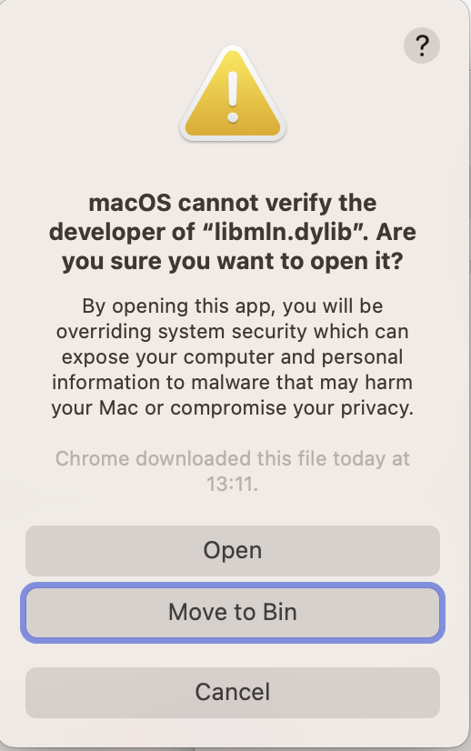
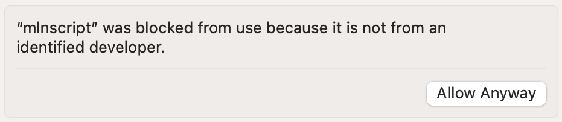

```{r include=FALSE}
knitr::opts_chunk$set(
  message = FALSE,
  warning = FALSE,
  collapse = TRUE,
  comment = '#>'
)
```

## Introduction

This post shows how to run MLwiN on Apple Silicon Macs from R using the **R2MLwiN** package [@mlwin;@r2mlwin]. This is achieved using the non-graphical version of MLwiN called `mlnscript` (`mlnscript.exe` on Windows) which has an accompanying library `libmln.dylib`.^[This post is essentially a more detailed explanation of the advice given on the MLwiN website, [here](https://www.bristol.ac.uk/cmm/software/support/support-faqs/commands-macros.html) and [here](https://www.bristol.ac.uk/cmm/software/mlwin/features/sysreq.html#unix).]

## Setup steps

* Obtain the `MLN.dmg` installer from the Centre for Multilevel Modelling and then install it, see the relevant download page (depending upon whether you are an academic) on the MLwiN [website](https://www.bristol.ac.uk/cmm/software/mlwin/).
* On macOS it is recommended to install the files into the `/opt/mln/` directory, which you will need to create with Admin permissions, or install to another directory if you don't have Admin permissions.
* Once installed we can check that `mlnscript` and `libmln.dylib` are universal binaries,
  ```{bash}
  lipo -archs /opt/mln/mlnscript
  ```
  ```{bash}
  lipo -archs /opt/mln/libmln.dylib
  ```  
  since both architectures are listed this indicates both files are universal binaries. Apple Silicon Macs will use the arm64 architecture.
* Now we need to grant the two files permission to run. To do this run in the Terminal app
  ```bash
  /opt/mln/mlnscript --version
  ```
  which will fail with a pop-up similar to the following.
  ```{r echo=FALSE}
  
  ```
  Click *Cancel* and then go into the *System settings...* | *Privacy & Security* and scroll down and click *Allow Anyway*
  ```{r echo=FALSE}
  
  ```
  Do the same for `libmln.dylib`.

* We can then check it's running with
  ```{bash}
  /opt/mln/mlnscript --version
  ```
  which should output the version number, which is currently 3.08.

* In R we then install the **R2MLwiN** package from CRAN.
  ```r
  install.packages("R2MLwiN")
  ```

* For an example we could run one of the demos in the package, which we can list with
  ```r
  demo(package = "R2MLwiN")
  ```
  Then run one (output omitted), for example
  ```r
  library(R2MLwiN)
  # if you did not install mlnscript in /opt/mln , set:
  # options(MLwiN_path = "/path-to/mlnscript")
  demo(UserGuide02)
  ```

## Summary

Despite having *Win* in its name, the core libraries for running MLwiN on other platforms, including macOS for both Intel and Apple Silicon processors and various Linux and Unix distributions (Debian, Fedora, FreeBSD, Rocky, and Ubuntu), have been available for sometime and are straightforward to use from R via the R2MLwiN package.

## References
