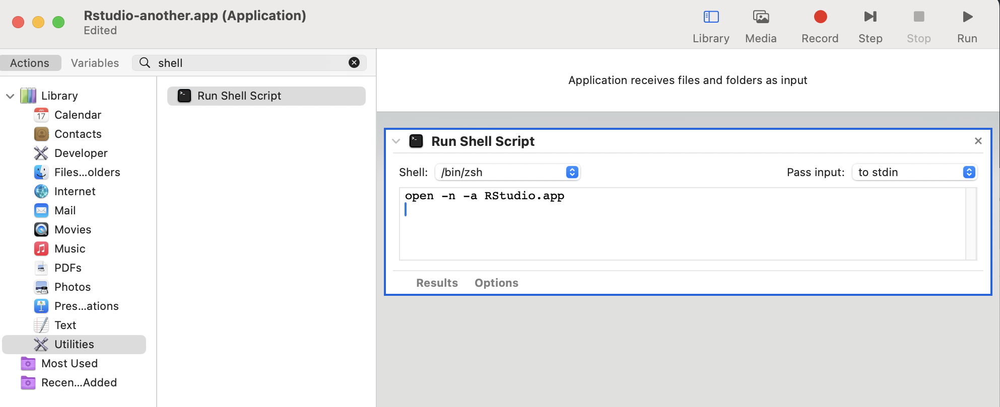

## Introduction: how to open a second instance of RStudio Desktop on macOS

On macOS when RStudio Desktop is open it can be inconvenient to open a second (or third or fourth) instance of it.

If you left click the RStudio Desktop icon nothing happens. If you right click on the RStudio Desktop icon there is a convenient *New RStudio Window*. The problem with this is that by default if you have an RStudio project open the new RStudio window is also opened in that project. However, that can be overcome by opening the RStudio preference pane and in the first tab (*General* | *Basic*) deselecting the boxes relating to *Restore most recently opened project at startup* and *Restore previousy open source documents at startup*.

```{r echo=FALSE, fig.alt="Screenshot of RStudio Desktop preference pane."}

```

```{r echo=FALSE, fig.alt="Screenshot of right clicking on the RStudio Desktop icon in the dock."}

```

Alternatively, within RStudio Desktop we could select *File | Open Project...* but I've never found that very intuitive and somehow I've never got used to using RStudio's command palette.
If you have several directories configured as RStudio projects (with *.Rproj* files) that you've opened before you could open those from the top right project drop down menu or double click them from within Finder.

But let's say we want an even more convenient way of doing this -- an icon in the dock. Thanks to [this](https://stackoverflow.com/a/40673644) Stackoverflow answer, it turns out that in a terminal we can issue the following `open` command to achieve opening a new instance of RStudio Desktop (note RStudio Desktop needs to be installed in your Applications directory for this to work).

```bash
open -n -a RStudio.app
```

## Making an Automator app to open a new instance of RStudio Desktop

macOS comes with Automator, open that from your Applications directory.
Then select *File | New* and select *Application* and click *Choose*.
Then from the left most menu select *Utilities* and double click *Run Shell Script*.
In the main window on the right, leave the shell as zsh and replace the `cat` text in the box with the `open` command above.

```{r echo=FALSE, fig.alt="Screenshot of configuring the automator app to run a shell script to open a new instance of RStudio Desktop."}

```

Then press <kbd>Cmd</kbd> + <kbd>S</kbd> or *File | Save* and save your application in your Applications folder.
Give the app a distinct name such as *RStudio-new-instance.app* or whatever you prefer and then quit Automator.

Next we would like our app to have a nice icon.^[I follow the approach detailed on [this](https://www.idownloadblog.com/2023/01/19/how-to-change-app-icons-mac/) blog and on the [README](https://github.com/amirmasoudabdol/rstudio-icons/tree/main?tab=readme-ov-file#usage) where I obtained the icon.]

* First download a nice icon from say [this](https://github.com/amirmasoudabdol/rstudio-icons/tree/main/Icons/macOS/Rectangle) repo of logos kindly designed for RStudio (I chose the dark one).
* Then navigate to the our new app in Finder and press <kbd>Cmd</kbd> + <kbd>I</kbd>.
* Then drag the *.icns* file onto the icon in the top left corner of the info box.
And tada your app will now use this icon!

And you can even drag the app from Finder onto your dock from where you can simply click the icon to open as many instances of RStudio Desktop as you like.

```{r echo=FALSE, fig.alt="Screenshot of our new app's icon in the dock.", out.width=319}
knitr::include_graphics('featured.png')
```

And because the new application is in our Applications directory it is found by Alfred (and hopefully Raycast).

```{r echo=FALSE, fig.alt="Screenshot of using Alfred to launch RStudio Desktop."}

```

## Summary

We have created an Automator application which runs a shell script to open a new instance of RStudio Desktop. We have then given this application a new icon and we have placed this on our dock.
