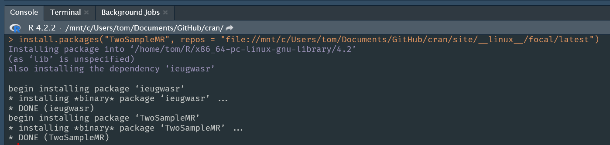

```{r include=FALSE}
knitr::opts_chunk$set(collapse = TRUE,
                      fig.align = 'center')
```

## Introduction

The publicly available RStudio (now Posit) Package Manager is a wonderful resource for two reasons, it provides

* CRAN snapshots
* Binary R packages for several Linux distributions.

This post shows how we can recreate some of this magic for ourselves.

## The structure of CRAN

In two excellent blog posts Marks Sellors describes how to make a basic CRAN like repository. And indeed there is even an excellent package, **miniCRAN** to help us do this.

To host bundled source packages (i.e., package sources which have been run through `R CMD build` to make a `package_version.tar.gz` file) we require the following directory structure.

```{bash, echo=FALSE}
# tree ~/Downloads/cran/latest
# brew install tree
tree ~/Documents/GitHub/cran/site -A -d -I '__linux__|bin' --noreport
```

Into the `contrib` directory we place the package `.tar.gz` files and 3 additional files (`PACKAGES`, `PACKAGES.gz`, and `PACKAGES.rds`) generated by `tools::write_PACKAGES()`.

## Adding Windows and macOS binary R packages

Since CRAN distributes binary packages for Windows and macOS we follow their directory structure, which becomes

```{bash, echo=FALSE}
# brew install tree
tree ~/Documents/GitHub/cran/site -d -I '__linux__' --noreport
```

* We place binary Windows packages into `bin/windows/contrib/4.2/`.
* We place binary x86_64 macOS packages into `bin/macosx/contrib/4.2/`.
* We place binary arm64 (i.e., Apple Silicon) macOS packages into `bin/macosx/big-sur-arm64/contrib/4.2/`

## Where to place Linux binary packages

CRAN does not distribute Linux binary packages and so there is no folder structure to copy from them for these.

However there is from the RStudio/Posit Package Manager, which achieves this with a beautiful little trick.

On Linux when we build binary packages with `R CMD install --build` they are generated with file names such as `pkgname_version_R_x86_64-pc-linux-gnu.tar.gz`.

Posit rename these files to simply `pkgname_version.tar.gz`.

They then place them in a parallel directory, called `__linux__`, with the same structure as for CRAN's source packages.

```{bash, echo=FALSE}
tree ~/Documents/GitHub/cran/site -d -I 'focal' --noreport
```
Hence, binary packages for Ubuntu Focal Fossa are placed into `__linux__/latest/src/contrib`. If you do not rename the binary packages with the original long `.tar.gz` file name R seems not to find the package.

Once this folder structure is being served set our repository to `.../__linux__/latest` and R will find the `.tar.gz` files under `src/contrib`.

This also means that the `.tar.gz` files within `__linux__/latest/src/contrib` can be a mix of source and binary packages if you haven't had time to build all your binary versions yet.

## Testing your CRAN-like repositories locally

You can either run a local webserver or use the `file://` URL notation as your `repos`, for example.

```{r echo=FALSE}

```
